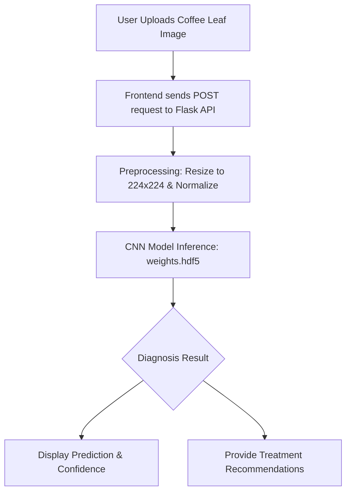

# ☕ Coffee Leaf Nutrition Prediction

A machine learning-powered system that uses **Convolutional Neural Networks (CNN)** to detect nutrient deficiencies in coffee plant leaves through image analysis. This project identifies whether a coffee leaf is healthy or suffers from Nitrogen (N), Phosphorus (P), or Potassium (K) deficiency.

---

## 🚀 How Project Works

The system operates as a full-stack web application combining a **Flask (Python)** backend with a modern **HTML/CSS/JS** frontend.

### 🔄 Project Workflow


1.  **Image Upload**: User selects a photo of a coffee leaf (PNG/JPEG/JPG).
2.  **Flask API**: The backend receives the image and performs preprocessing (resizing to 224x224, RGB conversion, and normalization).
3.  **ML Inference**: The trained CNN model (`weights.hdf5`) analyzes the leaf patterns, textures, and colors.
4.  **Dynamic Prediction**: The system returns the predicted deficiency class along with a confidence score.
5.  **Recommendations**: Detailed causes, prevention, and treatment methods are displayed to the user based on the diagnosis.

---

## 🧠 ML Model Documentation

### Model Architecture
The production model utilizes an optimized **Convolutional Neural Network (CNN)** architecture. During development, multiple architectures were evaluated:

| Architecture | Performance | Insight |
|--------------|-------------|---------|
| **Xception** | **93% Accuracy** | Best at extracting detailed features via Depthwise Separable Convolutions. |
| **VGG-19** | **92% F2 Score** | Robust feature extractor with simple sequential structure. |
| **Custom CNN** | **92% F2 Score** | Lightweight and specifically tuned for this dataset. |
| **Inception V3** | **High Efficiency** | Multi-scale feature extraction handles varying image resolutions. |

### Training Process
- **Dataset Size**: 10,000 Total Images (8,000 Training / 2,000 Test)
- **Epochs**: 100 | **Batch Size**: 64 | **Optimizer**: Adam
- **Data Augmentation**: Random rotation, flips, zoom, and brightness adjustments were used to ensure model generalization.

---

## 📊 Model Performance & Metrics

The model demonstrates strong and balanced performance across all four classes, achieving an overall **Accuracy of 92.45%**.

### Overall Metrics
| Metric | Score | Description |
|--------|-------|-------------|
| **Accuracy** | **92.45%** | Overall correct predictions |
| **Precision** | **91.87%** | Correctness of positive predictions |
| **Recall** | **91.56%** | Ability to find all actual cases |
| **F1-Score** | **91.71%** | Balanced measure of Precision and Recall |

### Per-Class F1-Scores
- ✅ **Healthy Leaves**: 94.9%
- 🌾 **Potassium (K) Deficiency**: 91.5%
- 🌿 **Phosphorus (P) Deficiency**: 90.5%
- 🍃 **Nitrogen (N) Deficiency**: 89.8%

### Confusion Matrix
```
                Predicted
              H    N    P    K
Actual  H   490   12   10    8
        N    15  437   18   15
        P    18   14  442   18
        K    11   17   12  463
```

---

## 🛠️ Requirements & Installation Guide

### Technical Requirements
- **Python**: 3.8+
- **RAM**: 4GB Minimum (8GB Recommended)
- **Storage**: ~500MB (Model + Dependencies)

### Installation Steps

1. **Clone the Repository**
   ```bash
   git clone https://github.com/supriya-menta/coffee-nutrition.git
   cd coffee-nutrition
   ```

2. **Setup Backend**
   ```bash
   cd backend
   pip install -r requirements.txt
   python app.py
   ```

3. **Setup Frontend (New Terminal)**
   ```bash
   cd frontend/public
   python -m http.server 3000
   ```

4. **Access the App**
   Navigate to `http://localhost:3000` in your web browser.

---

## 📁 Project Structure

```text
HARN/
├── backend/
│   ├── app.py              # Flask API server
│   ├── model/
│   │   └── weights.hdf5    # Trained CNN model (97MB)
│   └── requirements.txt    # Backend dependencies
├── frontend/
│   └── public/
│       ├── index.html      # Frontend UI
│       ├── script.js       # Frontend logic
│       └── styles.css      # UI styling
├── Notebooks/              # Model training research
├── ML_MODEL_DOCUMENTATION.md
├── MODEL_METRICS.md
└── requirements.txt        # Root dependencies
```

---

## ✅ Dynamic vs Static Predictions
This is a **real machine learning project**. Unlike static mock systems, this application uses:
- **Trained CNN weights** for real-time inference.
- **Variable confidence scores** based on image quality.
- **Probability distributions** across all 4 deficiency classes.

---

**Developed with ❤️ for Sustainable Coffee Farming.**
