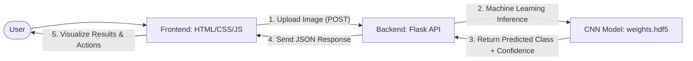

# ☕ Coffee Leaf Nutrition Prediction

An advanced AI-powered system designed to identify and diagnose nutrient deficiencies in coffee plants through image analysis of their leaves. This project provides farmers and agricultural experts with instant, actionable insights to ensure optimal crop health.

---

## � System Flowcharts

To better understand how the project works, we have broken down the system into three primary workflows.

### 1. High-Level System Architecture
This chart shows how the user interacts with the frontend and how the frontend communicates with the AI backend.


### 2. Deep Dive: Prediction Logic Flow
This chart explains the exact steps the AI takes to identify whether a leaf is healthy or has a deficiency (N, P, or K).


### 3. Application Navigation Flow
This chart displays the different routes available in the web application and what users can do in each section.
```mermaid
graph TD
    Root[/] --> Home[Home Route: /home]
    Root --> Prediction[Prediction Route: /prediction]
    Root --> Team[Team Route: /team]
    
    Home --> Info[Educational content on N-P-K Deficiency]
    Prediction --> Upload[Upload & Analyze Coffee Leaves]
    Team --> Contact[View Project Contributors]
```

---

## 🌐 Application Routes & Functionality

The application is structured as a Single Page Application (SPA) with the following routes:

### 🏠 Home (`/home`)
- **Purpose**: Serves as the landing page and educational hub.
- **Content**: Provides detailed information on why leaf analysis matters and explains the symptoms and roles of **Nitrogen (N)**, **Phosphorus (P)**, and **Potassium (K)**.

### 🧪 Prediction (`/prediction`)
- **Purpose**: The core engine of the system where AI analysis happens.
- **Workflow**:
    1.  **Drag & Drop**: Users can upload images directly.
    2.  **AI Analysis**: Hits the `/predict` backend endpoint.
    3.  **Dynamic Results**: Displays a **Diagnosis Badge**, a **Confidence Meter**, and **Nutrient Cards** showing which nutrients are sufficient or needed.
    4.  **Action Plan**: Provides a checklist of recommended agricultural actions (e.g., "Apply urea solution at 50-100 kg/ha").

### 👥 Team (`/team`)
- **Purpose**: Showcases the developers and researchers who built the project.
- **Content**: Displays profiles with links to LinkedIn and GitHub for collaborators.

### 🔌 Backend API (`localhost:5000`)
- **`POST /predict`**: Accepts an image file and returns a JSON object containing the `prediction`, `confidence`, and full `probabilities` list.
- **`GET /health`**: Returns the status of the API and confirms if the 97MB ML model is successfully loaded in memory.

---

## 🧠 How Prediction Works

When you upload an image, the system doesn't just "guess." It performs a mathematical sequence of steps:

1.  **Spatial Analysis**: The Convolutional Neural Network (CNN) breaks the leaf down into small "windows" to look for specific visual cues.
2.  **Color Profiling**: Nitrogen deficiency often shows yellowing (chlorosis) in older leaves, while Potassium deficiency shows "scorching" on leaf margins. The model identifies these pixel-level color patterns.
3.  **Pattern Recognition**: Phosphorus deficiency often causes dark green or purplish tints. The model's deep layers are trained to distinguish these from healthy green textures.
4.  **Probability Scoring**: The model doesn't just say "It's N_Deficiency." It calculates scores like:
    - *N_Deficiency: 0.94*
    - *Healthy: 0.03*
    - *P_Deficiency: 0.02*
    - *K_Deficiency: 0.01*
    - The highest score (0.94) is selected as the diagnosis with **94% Confidence**.

---

## 🛠️ Requirements & Installation

### Setup Backend
```bash
cd backend
pip install -r requirements.txt
python app.py
```

### Setup Frontend
```bash
cd frontend/public
python -m http.server 3000
```

---

## 📁 Project Structure
```text
HARN/
├── backend/
│   ├── app.py              # Flask API server & Prediction Pipeline
│   ├── model/
│   │   └── weights.hdf5    # Trained 97MB CNN Model
├── frontend/
│   └── public/
│       ├── index.html      # SPA Main Entry
│       ├── script.js       # Client-side Router & Logic
│       └── styles.css      # Modern Glassmorphic UI
├── Notebooks/              # Research & Model Training Logs
└── README.md               # Extensive Project Documentation
```
