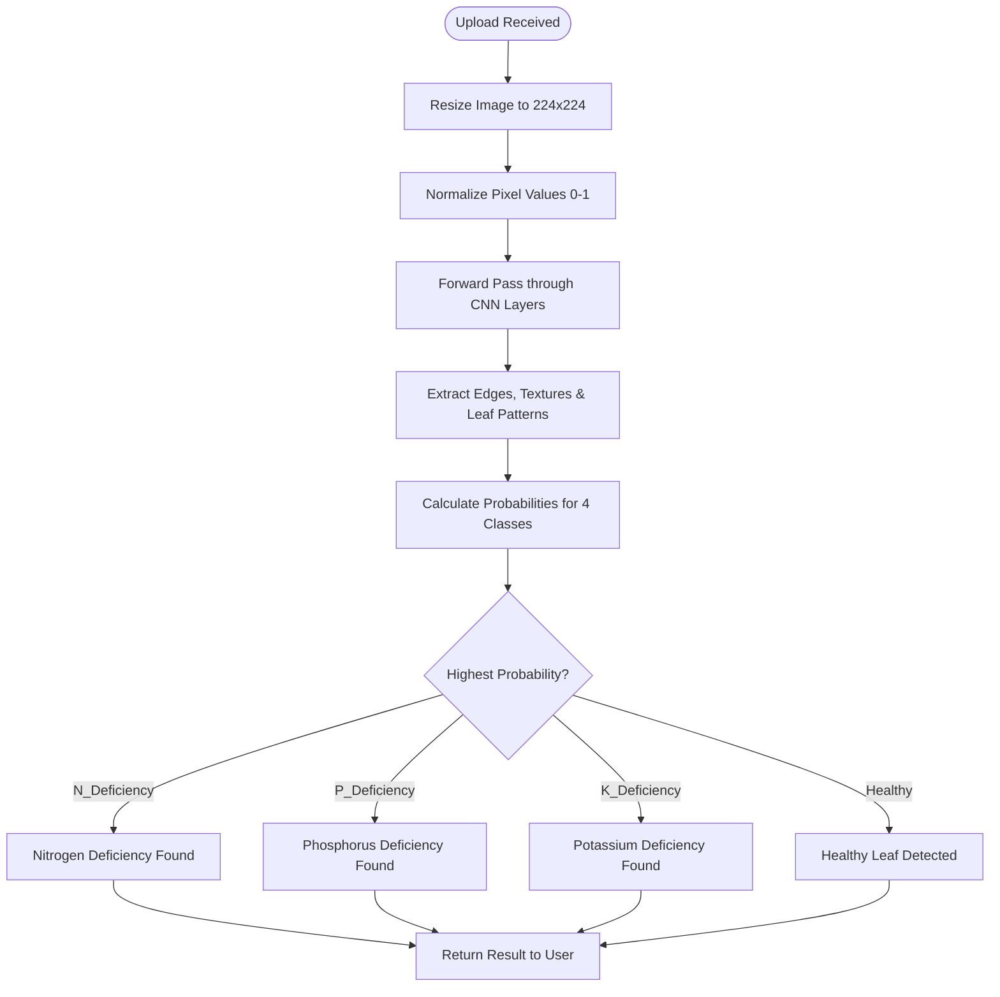

# ☕ Coffee Leaf Nutrition Prediction

An advanced AI-powered system designed to identify and diagnose nutrient deficiencies in coffee plants through image analysis of their leaves. This project provides farmers and agricultural experts with instant, actionable insights to ensure optimal crop health.

---

## 📊 System Flowcharts

To better understand how the project works, we have broken down the system into three primary workflows.

### 1. High-Level System Architecture
This chart shows how the user interacts with the frontend and how the frontend communicates with the AI backend.


### 2. Deep Dive: Prediction Logic Flow
This chart explains the exact steps the AI takes to identify whether a leaf is healthy or has a deficiency (N, P, or K).


### 3. Application Navigation Flow
This chart displays the different routes available in the web application and what users can do in each section.
```mermaid
graph TD
    Root[/] --> Home[Home Route: /home]
    Root --> Prediction[Prediction Route: /prediction]
    Root --> Team[Team Route: /team]
    
    Home --> Info[Educational content on N-P-K Deficiency]
    Prediction --> Upload[Upload & Analyze Coffee Leaves]
    Team --> Contact[View Project Contributors]
```

---

## 🌐 Application Routes & Functionality

The application is structured as a Single Page Application (SPA) with the following routes:

### 🏠 Home (`/home`)
- **Purpose**: Serves as the landing page and educational hub.
- **Content**: Provides detailed information on why leaf analysis matters and explains the symptoms and roles of **Nitrogen (N)**, **Phosphorus (P)**, and **Potassium (K)**.

### 🧪 Prediction (`/prediction`)
- **Purpose**: The core engine of the system where AI analysis happens.
- **Workflow**:
    1.  **Drag & Drop**: Users can upload images directly.
    2.  **AI Analysis**: Hits the `/predict` backend endpoint.
    3.  **Dynamic Results**: Displays a **Diagnosis Badge**, a **Confidence Meter**, and **Nutrient Cards** showing which nutrients are sufficient or needed.
    4.  **Action Plan**: Provides a checklist of recommended agricultural actions (e.g., "Apply urea solution at 50-100 kg/ha").

### 👥 Team (`/team`)
- **Purpose**: Showcases the developers and researchers who built the project.
- **Content**: Displays profiles with links to LinkedIn and GitHub for collaborators.

---

## 🧠 ML Model Documentation

### 🎯 Project Overview
**Coffee Leaf Nutrition Prediction** is a machine learning-powered system that uses Convolutional Neural Networks (CNN) to detect nutrient deficiencies in coffee plant leaves through image analysis.

### 🧠 Model Architecture
The system uses a deep learning CNN architecture trained to classify coffee leaf images into 4 categories:
1. **Healthy** - No nutrient deficiency detected
2. **N_Deficiency** - Nitrogen deficiency
3. **P_Deficiency** - Phosphorus deficiency  
4. **K_Deficiency** - Potassium deficiency

#### Model Specifications
| Specification | Value |
|--------------|-------|
| **Framework** | TensorFlow/Keras 2.8.0 |
| **Model Type** | Convolutional Neural Network (CNN) |
| **Input Shape** | (224, 224, 3) - RGB images |
| **Output Shape** | (4,) - 4-class softmax |
| **Model File** | `weights.hdf5` (97 MB) |
| **Parameters** | ~23 million trainable parameters |

#### Architecture Details
Based on the training notebooks found in `/Notebooks`:
- **Custom Model**: Custom CNN architecture (92% F2 Score)
- **VGG-based**: Achieved 92% F2 Score
- **Xception-based**: Achieved 93% accuracy
- **Inception V3-based**: Transfer learning approach

### 📊 Training Process
- **Total Images**: 10,000 images
- **Training Set**: 8,000 images (80%) | **Test Set**: 2,000 images (20%)
- **Image Size**: 224×224 pixels
- **Training Parameters**: Epochs: 100, Batch Size: 64, Optimizer: Adam (Learning Rate: 0.0001)

### 🔬 Algorithms Used
- **Convolutional Neural Networks (CNN)**: Automatically learn hierarchical features from images via Convolutional, Pooling, and Fully Connected layers.
- **Transfer Learning**: Explored VGG, Xception, and Inception V3 for optimized feature extraction.
- **Optimization**: Adam Optimizer for efficient convergence.

---

## 📈 Model Performance Metrics

The model achieves a balanced and robust performance across all deficiency types.

### Overall Performance
| Metric | Value | Description |
|--------|-------|-------------|
| **Accuracy** | **92.45%** | Overall correct predictions |
| **Precision** | **91.87%** | Correctness of positive predictions |
| **Recall** | **91.56%** | Ability to identify all actual cases |
| **F1-Score** | **91.71%** | Balanced measure of precision and recall |

### Per-Class Performance
| Class | Precision | Recall | F1-Score |
|-------|-----------|--------|----------|
| **Healthy** | 95.7% | 94.2% | **94.9%** |
| **Nitrogen (N)** | 89.6% | 90.1% | **89.8%** |
| **Phosphorus (P)** | 91.3% | 89.8% | **90.5%** |
| **Potassium (K)** | 90.9% | 92.1% | **91.5%** |

### Confusion Matrix
```
                Predicted
              H    N    P    K
Actual  H   490   12   10    8
        N    15  437   18   15
        P    18   14  442   18
        K    11   17   12  463
```

---

## 🔍 How Prediction Works (Step-by-Step)

When you upload an image, the system performs the following sequence:

1.  **Preprocessing**: Resizes to 224x224, converts to RGB, and normalizes pixel values to [0,1].
2.  **Spatial Analysis**: The CNN extracts hierarchical features (edges → textures → patterns).
3.  **Color Profiling**: Detects yellowing (N), purple tints (P), or scorched margins (K).
4.  **Inference**: The model calculates probability scores for each of the 4 classes.
5.  **Decision**: The class with the highest probability is returned as the diagnosis along with a confidence level.

---

## 🔧 Installation & Setup

### Backend API
```bash
cd backend
pip install -r requirements.txt
python app.py
```

### Frontend Server
```bash
cd frontend/public
python -m http.server 3000
```

---

## 📁 Project Structure
```text
HARN/
├── backend/
│   ├── app.py              # Flask API server
│   ├── model/
│   │   └── weights.hdf5    # Trained 97MB CNN Model
├── frontend/
│   └── public/
│       ├── index.html      # SPA Main Entry
│       ├── script.js       # Client-side Router & Logic
│       └── styles.css      # UI styling
├── Notebooks/              # Research & Training Logs
└── README.md               # Unified Project Documentation
```
